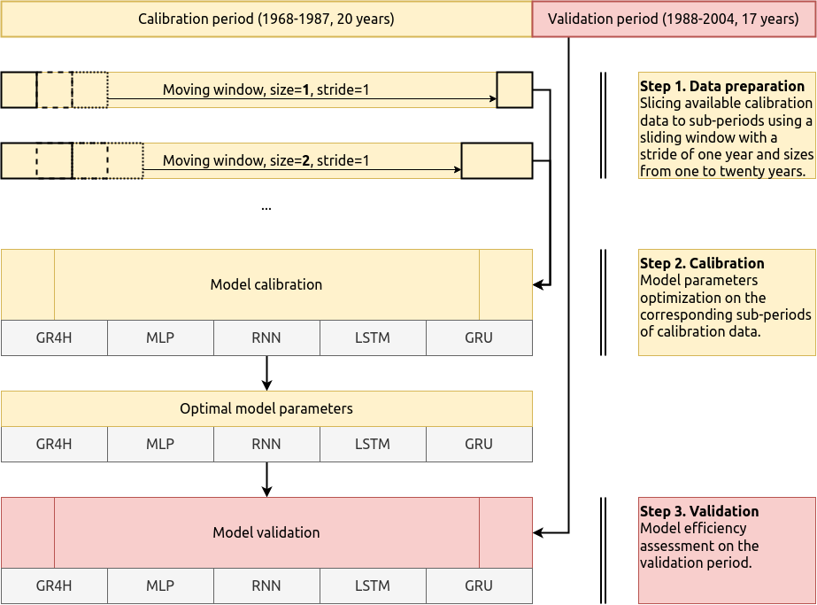

# KALI

## Investigating the effect of the calibration data length on the performance of hydrological models

In the present repository, you can find the materials for the paper 

> **Ayzel G., Heistermann M. The effect of calibration data length on the performance of conceptual versus data-driven hydrological models.** 

which was submitted to [*the Journal of Hydroinformatics*](https://iwaponline.com/jh/).


### Idea and workflow

In this study, we want to investigate the effect of calibration data length on the validation performance of different rainfall-runoff models. To this aim, we consequently increase the calibration data length from one to twenty calendar years and investigate how that affects the model skill on a hold-out (validation) period. 

-----



-----

We use five models for runoff prediction at hourly temporal resolution:

> one **conceptual**

1. GR4H -- a conceptual hydrological model. It is a derivative from [the GR4J model](https://webgr.inrae.fr/en/models/daily-hydrological-model-gr4j/) -- the version for runoff prediction at daily temporal resolution.

> and four **data-driven** models which differ by the type of the computational layer used

1. Multi-Layer Perceptron (MLP)
2. Recurrent Neural Network (RNN) 
3. Long Short-Term Memory Network (LSTM)
4. Gated Recurrent Units Network (GRU)

### Code

The code is written in [*Python*](https://docs.python.org/) programming language (v3.6) using open-source software libraries, such as [*numpy*](https://numpy.org/), [*pandas*](https://pandas.pydata.org/), [*scipy*](https://www.scipy.org/), [*numba*](http://numba.pydata.org/), [*tensorflow*](https://www.tensorflow.org/), and [*keras*](https://keras.io/). The analysis of obtained results was done also using [*jupyter notebooks*](https://jupyter.org/) and [*matplotlib*](https://matplotlib.org/) plotting library.

You can install all the required dependencies using [*conda*](https://docs.conda.io/projects/conda/en/latest/index.html) -- an open-source package management system. First, [install conda itself](https://docs.conda.io/projects/conda/en/latest/user-guide/install/index.html), then use the provided `environment.yml` file to create the isolated environment:

```bash
conda env create -f environment.yml
```

There are three files in the `code` directory:
1. [`experiment.py`](https://github.com/hydrogo/KALI/blob/master/code/experiment.py)

\- describes the workflow for the main calibration/validation experiment. 

2. [`metrics.py`](https://github.com/hydrogo/KALI/blob/master/code/metrics.py)

\- calculates and aggregates the evaluation metrics based on obtained results of streamflow simulation [](https://doi.org/10.5281/zenodo.3696832).

3. [`analysis.ipynb`](https://github.com/hydrogo/KALI/blob/master/code/analysis.ipynb)

\- represents the analysis of the effect of calibration data length on the performance of hydrological models.


### Models

There are two files in the `models` directory:
1. `gr4h.py`

\- holds the code for the GR4H hydrological model. 

2. `anns.py`

\- holds the code for generating data-driven hydrological models based on different architectures of artificial neural networks: MLP, RNN, LSTM, and GRU.

These files are used as modules in [`experiment.py`](https://github.com/hydrogo/KALI/blob/master/code/experiment.py).


### Results

Two files aggregate evaluation metrics for the calibration and validation periods: `summary_calibration.npy` and `summary_validation.npy`, respectively. The `figures` subfolder consists of figures that were generated using the [`analysis.ipynb`](https://github.com/hydrogo/KALI/blob/master/code/analysis.ipynb) jupyter notebook.


### Note on data availability

> Unfortunately, we cannot directly provide the compiled dataset we use for the presented study due to license restrictions from data suppliers.
> Thus, the discharge data for Rimbaud River as well as rain gauge records for the area Real Collobrier should request it from the RECOVER research laboratory at INRAE (https://www6.paca.inrae.fr/recover). The data for the SAFRAN reanalysis is also available upon request from Meteo France.
> 
> Please, [contact us](https://github.com/hydrogo/KALI/issues) in case you need additional details or support for retrieving the data.